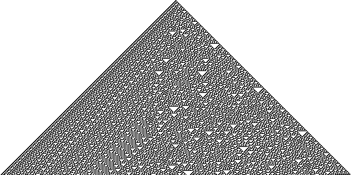
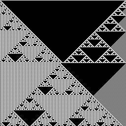
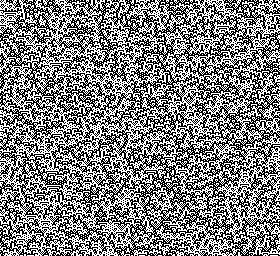
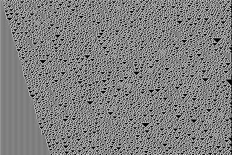

2022-07-08
# Rule N Cellular Automaton
A Rust implementation of the generalised [Rule 30](https://en.wikipedia.org/wiki/Rule_30) cellular automaton introduced by Stephen Wolfram in 1983.

# Usage
First clone the repository and build the binary:
```
cargo build --release
```
Then find the binary under `target/release/` and run it:
```
./rulen [OPTIONS] <--preset <PRESET>|--input <STATE>>
```

## Options
`-h, --height <HEIGHT>` ~ Height of the simulation (ie. image), dictates how many iterations are simulated. Minimum of 3 pixels and default of 256 pixels.

`--help` ~ Show options and quit.

`-i, --input <STATE>` ~ Manually set the initial state. The input state can be processed three different ways depending on the prefix: as binary, as hexadecimal, or as ASCII. For binary and hexadecimal, apply prefixes `0b` or `0x` respectively, whereas ASCII is assumed for anything else. Minimum length of 3 bits ie. 3 binary digits, 1 hexadecimal digit, or 1 ASCII character.
* Examples: `--input 0b1011101`, `-i 0xff12`, `-i celluar`, and `-i "cellular automaton"`.
* Note that simply the prefixes by themselves without any binary or hexadecimal digits following will be interpreted as ASCII.

`--no-wrapping` ~ Disable wrapping at the corners of each state, instead out-of-bounds neighbours are assumed to be `0`.

`-o, --output <FILEPATH>` ~ Manually provide a filepath for the output. Default is `output-{yy-MM-dd-HH-mm-ss}.ppm`.

`-p, --preset <PRESET>` ~ Automatically set the initial state. Currently four presets are defined, each of which are independent of the defined `width`.
* 0 - Random: string of random binary bits.
* 1 - Centre: string of binary `0`s except for a single binary `1` at the centre.
* 2 - Corners: string of binary `0`s except for two binary `1`s, one at the start and one at the end.
* 3 - Alternate: string of alternating binary `0`s and `1`s.

`-r, --rule <RULE>` ~ Sets the rule of the simulation. Range is from 0 to 255, inclusive, and default is 30.

`-w, --width <WIDTH>` ~ Width of the simulation (ie. image), dictates the size of the initial state and the states of all iterations. Minimum of 3 pixels and default of 256 pixels.

## Examples
**NOTE**: All .ppm images generated below were converted via ImageMagick to .png to be displayed here. Originals can be found in `examples/`.
```
./rulen --width 512 --height 256 --rule 30 --preset 1 --output ../../examples/1.ppm
```
<p align="center">
    
</p>

```
./rulen --width 256 --height 256 --rule 161 --preset 2 --no-wrapping --output ../../examples/2.ppm
```
<p align="center">
    
</p>

```
./rulen --height 256 --rule 105 --input "Stephen Wolfram's Cellular Automata" --output ../../examples/3.ppm
```
<p align="center">
    
</p>

```
./rulen --height 256 --rule 135 --input 0x4C6F72656D20697073756D20646F6C6F722073697420616D65742C20636F6E7365637465747572206164697069736369 --output ../../examples/4.ppm
```
<p align="center">
    
</p>

# Motivation
* First learnt about this from James Grime's [Cambridge has a new mathsy train station](https://youtu.be/aeyhnrZvQBE), and decided eventually to use it as a first project in Rust.
* It's also my first attempt at a *real* application, one that can be released and not be immediately broken.

# TODO
* Add brief explanation of the cellular automaton in README.
* Add .png support.
* Make default output file name prettier.
* Consider adding support for states in higher bases to allow for more colours than 2.
